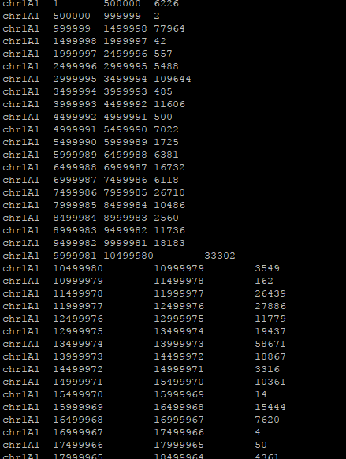
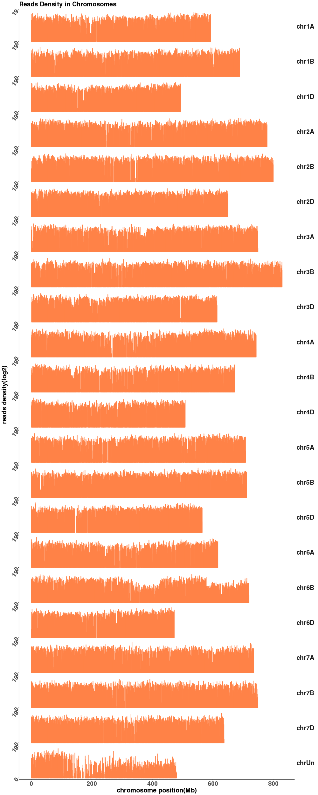

# Chromosome_Plot

1.Genome length file:  
 >Chr1A\t1\t1000 
 >Chr1B\t1\t2000 

2.Sliding window bed file 
 bedtools makewindows -b Chr.Length.Start.txt -w 1000000 -s 500000 > Split8.1Mb.500K.bed  

3.Bam file index  
samtools index T176-1.Realign.bam  

4.Coverage (Depth) Summary  
bedtools multicov -bams T176-1.Realign.bam -bed Split8.1Mb.500K.bed > Exome.Split8.1Mb.500K.coverage  

5.Plot depth along chromosomes  

Rscript Chromosome_Depth.R Exome.Split8.1Mb.500K.coverage Exome.Split8.1Mb.500K.png  

Results:  

